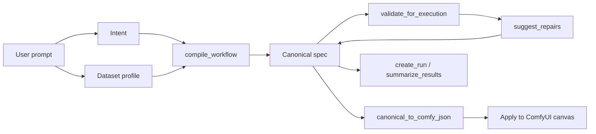

# ComfyBIO LLM UI Plan

## Goal

Build a ComfyUI-side interface where a user can describe a bioinformatics analysis in natural language, review the LLM-normalized intent and dataset profile, compile a canonical harness spec, validate/repair it, and apply the resulting ComfyUI graph to the canvas.

The new direction follows `harness_core`: a ComfyUI-only compiler/repair harness with a canonical spec between the LLM and ComfyUI JSON. The UI should make that loop visible:



## Product Shape

The first version should be a ComfyUI extension panel, not a separate website. It should not stay permanently open on the canvas. ComfyUI should expose a compact draggable DNA launcher icon; clicking it expands a floating harness console from that icon:

- persistent UI: one compact circular DNA launcher icon that the user can move with the mouse
- opened UI: floating panel over the ComfyUI canvas, with the launcher icon included as the panel's top-left collapse handle
- collapse behavior: clicking the same DNA icon again closes the panel back to the compact launcher
- opened panel hides visible scrollbars while preserving internal scrolling
- opened panel can be resized from horizontal, vertical, and corner edges
- three tabs: `Prompt`, `Tool Select`, and `Generate Graph`
- primary action: `Generate Graph`
- secondary actions: `Submit`, `Approve Spec`, `Add Step`

The panel can overlay part of the graph while open, but closing it should immediately return the user to a normal ComfyUI canvas. The user should be able to inspect generated nodes and paths in normal ComfyUI after applying.

## Visual Direction

The panel should borrow the restrained, research-oriented parts of `perplexity-DESIGN.md` without turning the ComfyUI helper into a dense report view:

- near-black canvas and surfaces: `#1C1C1C`, `#252525`, `#2F2F2F`
- sparse teal accent `#20B2AA` for the DNA launcher, active tabs, focus rings, and primary actions
- system font stack with reading-first body text and `line-height: 1.7`
- evidence and validation details should be available only when needed, preferably as a compact expandable section
- avoid always-visible draft result, source card, and citation blocks because they make the small floating panel too dense
- transitions stay short and respect `prefers-reduced-motion`

## Core User Flows

### 1. Prompt

Purpose: let the user log in to the LLM they want to use and submit natural-language analysis requests.

1. User chooses an LLM provider and authenticates.
2. User sets required `input_path` and `output_path` rows inside Analysis resources.
3. User adds additional labeled analysis resources such as metadata, reference, index, annotation, or contrast files.
4. User enters a prompt such as "Analyze this FASTQ folder as RNA-seq, human GRCh38, treated vs control."
5. UI sends the prompt plus paths and labeled resources.
6. Backend returns:
   - normalized `intent`
   - `dataset_profile`
   - draft canonical `spec`
   - confidence notes or clarification requests

### 2. Tool Select

Purpose: get explicit user approval before generating the ComfyUI workflow.

1. UI shows the planned analysis tool order from the canonical spec.
2. User can edit tools, replace tools, remove tools, or reorder tools.
3. `Replace` opens a TSR-backed candidate picker for that step.
4. Candidate tools are filtered by step role and artifact compatibility, such as `trimmed FASTQ input / aligned BAM output`.
5. UI shows the resulting node/edge contract and key parameters.
6. User approves the spec before ComfyUI workflow generation proceeds.

### 3. Generate Graph

Purpose: present a final summary from the Prompt and Tool Select tabs, then generate the ComfyUI graph.

1. UI summarizes the selected LLM provider/model and analysis resources.
2. UI summarizes the approved analysis domain and selected tool sequence.
3. User presses one `Generate Graph` button.
4. Backend generates the ComfyUI workflow, handles required node implementation, validates the graph, and applies it to ComfyUI.

## UI Components

### Prompt Tab

Purpose: LLM login and natural-language analysis request intake.

Expected controls:

- LLM provider selector
- provider choices: `codex`, `claude`, `gemini`
- model selector filtered by the selected provider
- provider/model controls grouped inside an `LLM settings` section
- login/connect status
- resource list with `label`, `type`, and `path`
- required resource rows for `input_path` and `output_path`
- each resource row includes a file/folder picker popup button for path selection
- `input_path` and `output_path` keep fixed labels and hidden resource types instead of an editable type selector
- add/remove resource controls
- prompt textarea grouped inside an `Analysis request` section
- submit button
- clear/reset button
- message timeline with status chips

### Tool Select Tab

Purpose: user approval of the workflow plan before ComfyUI graph generation.

Expected controls:

- flat tab content without an extra top-level `Tool Select` card
- one vertical workflow step list that combines overview and editing
- each collapsed step shows order, stage label, and one selected tool
- clicking a step expands input/output details and TSR replacement candidates
- expanding a step collapses any previously expanded step
- expand/collapse uses a short height and opacity transition
- drag handle for reordering steps
- `x` button for removing a step
- add-step menu for restoring an accidentally removed step
- replace tool button that opens a TSR-backed candidate dropdown/popover
- candidate compatibility labels for input/output artifact contracts
- compact evidence/validation details when the user needs to inspect why a tool was recommended
- sticky approve-spec action bar
- approve spec button

### Generate Graph Tab

Purpose: summarize the prompt inputs and selected tools, then generate the ComfyUI graph.

Expected controls:

- flat tab content without an extra top-level `Generate Graph` card
- no `Current task` summary card
- summary of selected LLM provider/model
- summary of input path, output path, and labeled resources
- summary of analysis domain and selected tool sequence
- single generate graph button

## Backend Contract

Initial request:

```json
{
  "request_text": "Analyze this FASTQ folder as RNA-seq, human GRCh38, treated vs control.",
  "input_path": "/data/project/fastq",
  "output_path": "/data/project/results",
  "resources": [
    {
      "label": "sample_metadata",
      "type": "metadata",
      "path": "/data/project/sample_metadata.csv"
    },
    {
      "label": "gtf_annotation",
      "type": "annotation",
      "path": "/refs/gencode.v44.annotation.gtf"
    }
  ],
  "intent_hint": {
    "analysis_type": "rna_seq",
    "species": "human",
    "genome_build": "GRCh38",
    "comparison": "treated_vs_control"
  }
}
```

Resource mapping rules:

- `input_path` and `output_path` are always sent as first-class fields.
- Optional analysis resources are sent as `resources[]` with user-visible `label`, broad `type`, and filesystem `path`.
- The LLM can propose how labels map to workflow requirements, but it must not invent missing paths.
- The validator confirms required resources before graph generation and reports missing or ambiguous labels.
- The compiler stores the resolved resource map in the canonical spec so ComfyUI node widgets can be populated automatically.

Successful response:

```json
{
  "status": "spec_ready",
  "intent": {
    "analysis_type": "rna_seq",
    "species": "human",
    "genome_build": "GRCh38",
    "comparison": "treated_vs_control"
  },
  "dataset_profile": {},
  "spec": {},
  "comfy_json": {},
  "validation": {
    "status": "success",
    "errors": []
  },
  "canvas_actions": ["approve_spec", "choose_workflow", "implement_nodes", "generate_graph"]
}
```

Repair response:

```json
{
  "status": "repair_available",
  "validation": {
    "status": "error",
    "errors": [
      {
        "code": "input_missing",
        "path": "inputs.input_data",
        "message": "Input path is missing or empty."
      }
    ]
  },
  "repairs": [
    {
      "type": "set_value",
      "path": "inputs.input_data",
      "value": "/tmp/comfybio_harness_mvp/input"
    }
  ]
}
```

## Architecture

### Frontend

Add a ComfyUI web extension under the custom-node `WEB_DIRECTORY` path.
The current implementation is `web/js/comfybio_panel.js`, exposed by the
repository-root `WEB_DIRECTORY = "./web/js"`.

Responsibilities:

- render the persistent `ComfyBIO` launcher button
- open/close the floating harness console on click
- collect prompt, provider/model choice, `input_path`, `output_path`, and labeled `resources[]`
- call ComfyBIO backend endpoints
- display the three tabs: Prompt, Tool Select, and Generate Graph
- support one-expanded-step tool selection, drag reordering, add-step recovery, scrollbar hiding, and edge/corner panel resizing
- call ComfyUI canvas import/open workflow behavior after user approval

### Backend

Add a small UI service layer around `harness_core` functions.

Responsibilities:

- normalize UI payloads into `intent`, `input_path`, `output_path`, and `resources[]`
- preserve user-provided resource labels and paths without LLM rewriting
- call `profile_dataset`
- call `compile_workflow`
- resolve resource labels to canonical spec inputs and node widget parameters
- expose tool-order editing on the canonical spec
- call `validate_spec` and `validate_for_execution`
- report missing, duplicate, or ambiguous resource labels before graph generation
- identify reusable and missing ComfyUI nodes
- call `canonical_to_comfy_json`
- return structured JSON responses
- keep LLM provider concerns behind an adapter

### LLM Adapter

The first implementation should keep deterministic harness parsing as the default. LLM calls should be optional and isolated behind an adapter so tests can run without network access.

Suggested adapter methods:

- `normalize_prompt(request) -> intent`
- `map_resources(request, spec) -> ResourceMapping`
- `explain_spec(spec) -> AssistantMessage`
- `summarize_validation(validation_result) -> AssistantMessage`
- `propose_repair(error, spec) -> RepairSuggestion`

## State Model

The UI can treat every interaction as a session with these states:

- `idle`
- `profiling_dataset`
- `compiling_spec`
- `spec_ready`
- `spec_editing`
- `spec_approved`
- `choosing_workflow`
- `implementing_nodes`
- `workflow_ready`
- `error`

## Implementation Milestones

1. UI plan and static mockup
2. Backend request/response DTOs around `harness_core`
3. Deterministic compile endpoint using `profile_dataset`, `compile_workflow`, and `canonical_to_comfy_json`
4. ComfyUI launcher button and floating panel shell
5. Tool Select step editor
6. Generate Graph summary screen
7. Generate-graph action
8. Optional LLM adapter
9. Compatibility bridge to existing `bioflow_harness` route-based generator if needed

## Testing Plan

- DTO serialization tests for UI request/response payloads
- deterministic service tests for RNA-seq intent and FASTQ dataset profile
- canonical spec validation tests
- execution validation and repair tests
- ComfyUI adapter round-trip tests: `canonical_to_comfy_json` then `comfy_json_to_canonical`
- ComfyUI manual load test for panel and generated workflow
- visual regression snapshots for panel states if a frontend test runner is added

## Open Decisions

- The first UI is a compact `ComfyBIO` launcher button that opens a floating tab panel.
- Whether `Apply Graph` should import the JSON directly or write a pending workflow record and ask the user to open it.
- Which LLM provider configuration mechanism should be used inside ComfyUI.
- Whether the canonical `RESULT` socket should remain generic in ComfyUI or adopt artifact-format names as the spec matures.
- Whether actual non-dry-run execution controls belong in this panel or should remain a later run-management feature.
